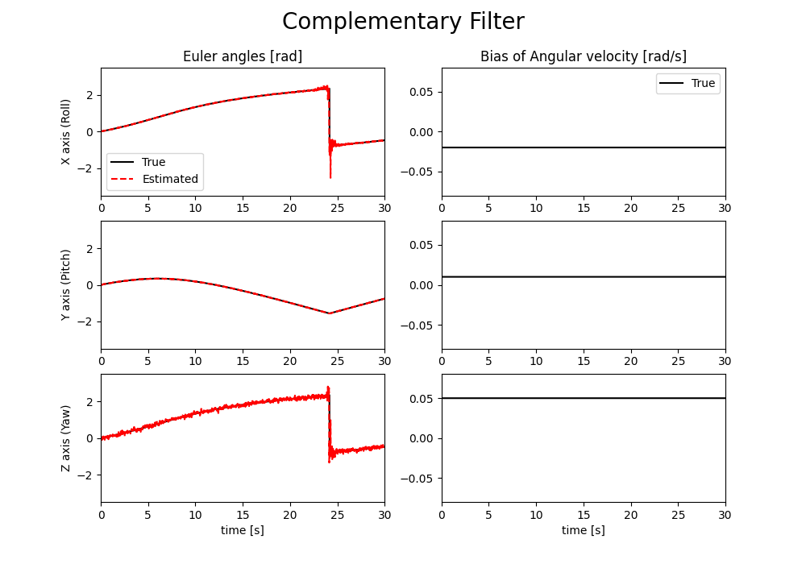

# 相補フィルタ

姿勢（四元数）のみ推定します。
実行結果の図には、加えた角速度バイアスだけ表示しています。

## 実行方法

```
$ cargo run && python3 data_plot.py
```

## 実行結果



上図のシミュレーション条件は、以下の通り。
* サンプリング周期：0.02 s
* 角速度バイアス[x, y, z]：[-0.02, 0.01, 0.05] rad/s
* 角速度計測値に加わるノイズ分散：0.0001
* 加速度　　　　　　〃　　　　　：0.01
* 地磁気　　　　　　〃　　　　　：0.01
* 相補フィルタ（の中のLPF）のカットオフ周波数：10 Hz
