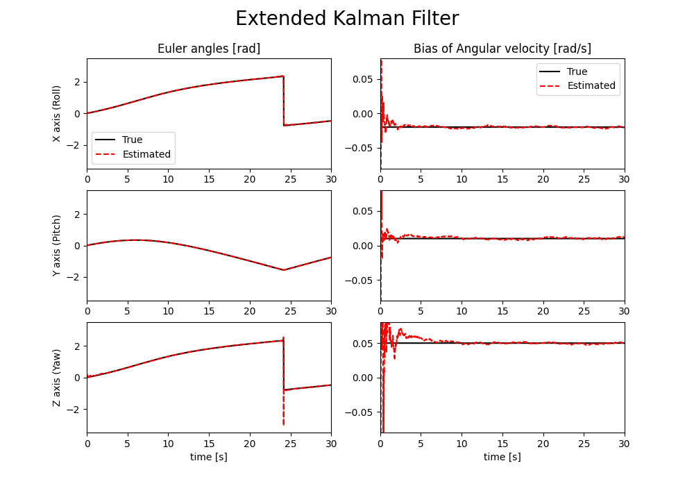

# 拡張カルマンフィルタ

姿勢（四元数）と角速度バイアスを推定します。

U-D分解フィルタ[1]での実装としていますが、代数的には一般に知られる拡張カルマンフィルタと同じ計算結果となります。

## 実行方法

```
$ cargo run && python3 data_plot.py
```

## 実行結果


上図のシミュレーション条件は、以下の通り。
* サンプリング周期：0.02 s
* 角速度バイアス[x, y, z]：[-0.02, 0.01, 0.05] rad/s
* 角速度計測値に加わるノイズ分散：0.0001
* 加速度　　　　　　〃　　　　　：0.01
* 地磁気　　　　　　〃　　　　　：0.01

※ 乱数を使っている関係上、同じ条件で実行しても発散してしまうことがあります。

## 参考文献

[1] 片山 徹，”応用カルマンフィルタ”，朝倉書店, 1983.